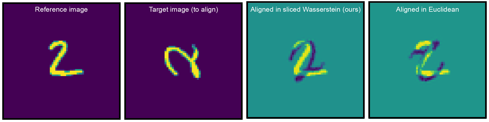

## Fast alignment of heterogeneous images in sliced Wasserstein distance

We develop a fast algorithm for computing the sliced 2-Wasserstein distance between two images. Additionally, this can be used for the rotational alignment of two $$L \times L$$ images in $$O(L^2 \log L)$$ operations. Our algorithm is shown to be robust to rotations, translations and deformations in the images.

See https://doi.org/10.48550/arXiv.2503.13756 for more details about the algorithm. 

Dependencies:
- numpy
- matplotlib
- scipy
- finufft

Additional dependencies (for other OT distances):
- pywavelets
- pot
- jax
- ott-jax

---
Please contact ev9102[at]princeton.edu with any questions.
