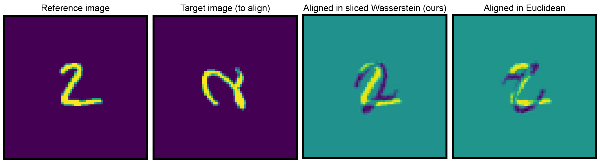

## Fast alignment of heterogeneous images in sliced Wasserstein distance

We present a fast algorithm for computing the sliced 2-Wasserstein distance between two images. This can be used for the rotational alignment of two $$L \times L$$ images in $$O(L^2 \log L)$$ operations. Our algorithm is shown to be robust to rotations, translations and deformations in the images.

See https://doi.org/10.48550/arXiv.2503.13756 for more details about the algorithm. 

### Tutorial on how to use the code will follow soon

Dependencies:
- numpy
- matplotlib
- scipy
- finufft
- pywavelets (optional)
- pot (optional)

---
Please contact ev9102[at]princeton.edu with any questions.
